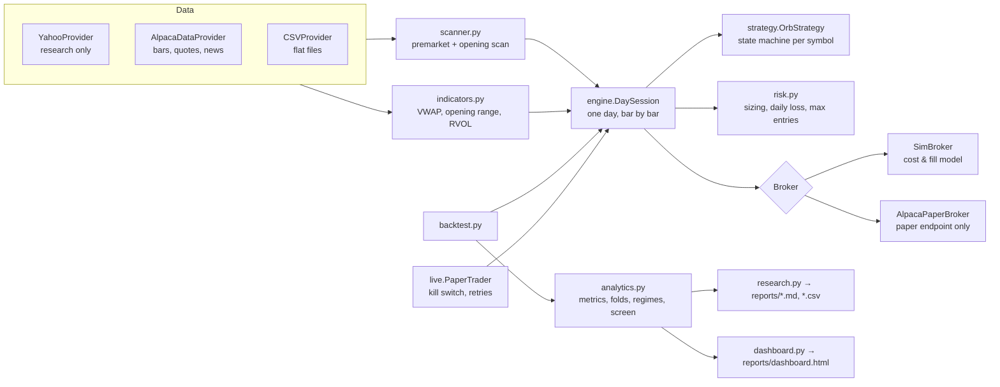

# AI Day-Trading System: design, research and first results

Status as of 2026-10-08: **built and tested; the strategy has NOT passed validation. Paper mode only.**

---

## 1. The strategy and its main weaknesses

**Strategy under test (V1).** Long-only 15-minute opening-range breakout on liquid "stocks in play":
- **Scan:** price ≥ $5, 20-day average daily volume ≥ 1M, and 9:30–9:45 volume ≥ 2× its 20-day average for that window.
- **Market filter:** SPY and QQQ both above their session VWAP.
- **Breakout:** a completed 5-minute close above the opening-range high, above VWAP and above the day's open.
- **Confirmation:** a pullback bar that tests the breakout level (low within 0.15× the range width) and closes back above it.
- **Entry:** a buy-stop 1¢ above that pullback bar, live for 2 bars. The stop goes 1¢ under the pullback bar's low.
- **Exits:** a 2R target, otherwise flat at 15:55. No new entries after 11:00.
- **Rejections:** skip if the entry is more than 0.5× the range width above the high (chasing), or if yesterday's high sits closer than 2R overhead.

**Main weaknesses, in rough order of importance:**

1. **Too many filters means too few trades.** Each rule (15-minute range, VWAP, market filter, retest, R:R check, relative volume ≥ 2) removes trades. On 63 liquid names over 40 days, V1 produced **10 trades**. At that rate it takes about two years of paper trading to reach the 100 trades the validation bar needs. A strategy you can't measure is a strategy you can't trust.
2. **The best breakouts never pull back.** Requiring a retest skips the strongest moves and keeps the ones that come back to the level. That selection can easily *hurt* expectancy. It needs to be tested, not assumed. V1 (retest) vs V3 (no retest) is that test.
3. **The 15-minute range is weaker than the 5-minute range in the evidence we have.** The published ORB research uses 5-minute ranges. Our earlier SPY/QQQ test also found the 5-minute ORB best and the 15/30-minute ranges worse.
4. **Long-only and market-filtered.** This halves the opportunity set and makes results depend on the market regime. In our run, almost all V2/V4 profit came on SPY up days.
5. **Tight stops make costs a large share of each trade.** A stop $0.34 away on IWM turned a −1R loss into −1.45R after spread and slippage. Costs scale with shares, and 0.25%-of-equity sizing on tight stops buys a lot of shares.
6. **The news catalyst can't be backtested honestly** without a point-in-time news archive, so backtests use volume and gap as a proxy. Live behavior can differ from the backtest because of this.
7. **5-minute bars hide the intrabar path.** The simulator assumes the worst case (stop before target, gaps fill at the open), so it errs pessimistic. Real fills can be better or worse.
8. **Published edges decay.** McLean & Pontiff (2016) found anomaly returns are ~26% lower out-of-sample and ~58% lower after publication. ORB has been widely published since 2023.
9. **Your current account can't run it.** At 0.25% risk, a $68 account risks $0.17 per trade, which rounds to 0 shares for almost every stock. This system is for paper trading now, and for a much larger account later if it ever validates.

## 2. Does the strategy have a credible historical edge?

| Source | Finding | How much weight |
|---|---|---|
| Zarattini & Aziz (2023), QQQ 5-min ORB ([CXO summary](https://www.cxoadvisory.com/technical-trading/day-trading-with-an-opening-range-breakout-strategy)) | 24% hit rate, +0.13R per trade | Single ETF, author-run backtest |
| Zarattini, Barbon & Aziz, *A Profitable Day Trading Strategy for the U.S. Equity Market* ([Concretum](https://concretumgroup.com/a-profitable-day-trading-strategy-for-the-u-s-equity-market/)) | 5-min ORB on the top-20 "stocks in play" (relative volume), 2016–2023: +1,600% net, Sharpe 2.81 | The strongest evidence for this family. Long **and** short, 5-minute range, and **no** VWAP/retest/market filters |
| Independent replication ([mql5 blog](https://www.mql5.com/en/blogs/post/776235)) | Gross results reproduced; **net of costs ≈ zero** | Single, unreviewed source, but a warning about costs |
| Barber, Lee, Liu & Odean (Taiwan) | 82% of day traders lose; under 1% are predictably profitable | Strong base rate against any day-trading edge |
| Our tests ([`research/PLAYBOOK.md`](../research/PLAYBOOK.md)) | SPY/QQQ 5-min ORB slightly positive on shares; 15/30-min worse; "guru" rules no edge | 60 days only; noise-level |
| **This system, first run (§7)** | No variant passes; 10–20 trades each, all t-stats < 1 | Far too few trades to conclude anything either way |

**Verdict:** there is credible but contested evidence for a **5-minute** ORB on high-relative-volume stocks, traded **both directions**, before frictions. The specific 15-minute, VWAP-filtered, pullback-retest, long-only version has **no direct published evidence**. Our data so far neither supports nor rules it out. Treat it as a hypothesis.

## 3. Market-data and paper-trading APIs

| Need | Recommended | Notes |
|---|---|---|
| Historical intraday bars (multi-year) | **Alpaca Market Data API**, `feed=sip`, `adjustment=split` | Free plan serves full-market SIP bars older than 15 minutes; 200 calls/min. ([docs](https://docs.alpaca.markets/docs/about-market-data-api), [historical](https://docs.alpaca.markets/docs/historical-stock-data-1)) |
| Survivorship-free universe | **Polygon/Massive flat files** (or Databento) via `CSVProvider` | Daily all-ticker minute files including delisted names; paid. ([third-party notes](https://github.com/shinathan/polygon.io-stock-database)) |
| Real-time bars and quotes | Alpaca `feed=iex` (free) or SIP (paid, ~$99/mo) | IEX is ~2.5% of volume, so its bars differ from consolidated bars. Use SIP before trusting paper results. |
| News catalysts | **Alpaca News API** (`/v1beta1/news`, Benzinga, history to 2015) | ([docs](https://docs.alpaca.markets/us/v1.4.2/docs/historical-news-data)) |
| Paper trading | **Alpaca paper trading API** (`paper-api.alpaca.markets`) | Bracket orders put the stop at the broker. ([orders](https://alpaca.markets/docs/working-with-orders), [brackets](https://alpaca.markets/blog/bracket-orders/)) |
| Research only | Yahoo chart endpoint | Unofficial, ~60 days of 5-minute bars, today's tickers only. Used for this first run because no API keys are configured here. |

Robinhood has **no paper-trading API**, and the Robinhood connector in this workspace trades real money. This system never uses it.

Credentials come only from the environment (`APCA_API_KEY_ID`, `APCA_API_SECRET_KEY`); nothing is hard-coded or written to disk. `.env` files are git-ignored.

## 4. Architecture



**Key design decisions:**
- **One decision loop for everything.** `engine.DaySession` is used by both the backtester and the paper trader, so they share strategy, sizing and risk code. A test confirms a replayed paper day produces the same entry as the backtest.
- **Look-ahead is blocked by construction.** The strategy only sees *completed* bars. Orders can only fill on bars that *start* after the order exists. A test changes future prices and confirms that earlier decisions don't move.
- **Safety:**
  - `config.check_mode` only accepts `backtest` or `paper`. There is no live-order code path at all.
  - `AlpacaPaperBroker` refuses any URL but the paper endpoint.
  - Options and short selling are rejected at config time.
  - A `KILL_SWITCH` file, 5 consecutive data/broker errors, or a stale feed all flatten everything and halt.

| Module | Role |
|---|---|
| `config.py` | Every parameter, fixed before testing; the pre-registered variants; mode guard |
| `data/` | Provider interface, Yahoo/Alpaca/CSV implementations, validation, retries with backoff |
| `indicators.py` | Session VWAP, opening range (5/15-minute), relative opening volume |
| `scanner.py` | Premarket watchlist (liquidity, spread, gap, news); opening scan (RVOL ranking) |
| `strategy.py` | `OrbStrategy` state machine; emits `EntrySignal` with reasons and invalidation conditions |
| `risk.py` | 0.25%-of-equity sizing net of costs, no leverage; 1% daily loss limit; max 2 entries per day |
| `engine.py` | `DaySession`: the shared per-bar loop and rule-violation checks |
| `broker/sim.py` | Simulated fills: spread, slippage, fees, random rejections, volume caps, gap-through stops |
| `broker/alpaca_paper.py` | Bracket orders to Alpaca paper; local book synced from the broker |
| `backtest.py` | Replays history through `DaySession` |
| `live.py` | `PaperTrader`: daily workflow, kill switch, reconnect, stale-data detection, daily report |
| `analytics.py` | Metrics, bootstrap CI, buy-and-hold benchmark, walk-forward folds, regimes, go/no-go screen |
| `journal.py` | Trade proposals in the required format (or `NO TRADE`), CSV journals |
| `dashboard.py` | Static HTML: stat tiles, equity vs SPY, drawdown, trades; light/dark themes |

## 5. Running it

```bash
pip install pandas numpy requests pytest
python -m pytest -q                                              # 22 tests
python -m daytrader backtest --data yahoo --cache data_cache     # research-grade, last ~60 days
export APCA_API_KEY_ID=...  APCA_API_SECRET_KEY=...              # free Alpaca paper account
python -m daytrader backtest --data alpaca --start 2024-01-02 --end 2026-09-30
python -m daytrader paper --data alpaca --broker alpaca          # run each trading day from ~9:15 ET
touch KILL_SWITCH                                                # emergency stop: flatten and halt
```

`TRADING_MODE` must be unset or `paper`; anything else raises an error before any work is done.

## 6. Backtest and paper-trading environment

**Cost and fill model** (`CostConfig`; deliberately pessimistic):

| Item | Assumption |
|---|---|
| Commission | $0 (Alpaca) |
| Half-spread | max($0.005, 1.5 bps) per side |
| Slippage | 1 bp extra on market and stop fills |
| Sale fees | SEC fee (0.00278%) + FINRA TAF ($0.000166/share, capped at $8.30). Approximate: these rates are reset periodically |
| Rejections | 2% of entry orders randomly rejected |
| Volume cap | Fill at most 2% of a bar's volume; the rest is cancelled (partial fill) |
| Stop/target conflict | Stop wins if both are touched in the same bar; the target is never taken on the entry bar |
| Gaps | A stop that gaps fills at the open, which is worse |
| Target fills | Only if the bar trades 1¢ through the target |

**Bias controls:**
- **Look-ahead:** decisions use completed bars only, enforced by a test.
- **Data leakage:** the scanner uses only prior days' volumes and daily bars.
- **Corporate actions:** symbols with a split inside the window are excluded, because Yahoo intraday bars are unadjusted; Alpaca uses `adjustment=split`.
- **Survivorship:** **not** controlled with Yahoo, since the universe is today's tickers. The fix is flat files that include delisted symbols.

**Validation protocol:**
- 4 variants, pre-registered in `config.VARIANTS` and each run once. No parameter search.
- Chronological 3-fold walk-forward. Parameters are fixed, so every fold is out-of-sample.
- Bootstrap 95% CI and t-stat on the mean R.
- Benchmarks: SPY buy-and-hold and no-trade.
- **Go/no-go screen** (`analytics.go_no_go`): ≥100 trades, positive expectancy after costs, profit factor ≥ 1.2, max drawdown < 5%, t-stat ≥ 2. Failing any one item means **do not trade live**.

## 7. First results (Yahoo 5-min, 2026-08-13 → 2026-10-08, 40 trading days, 63 symbols, $25k paper)

| Variant | Trades | Win % | Expectancy | PF | Max DD | Net after costs | Costs | t | Screen |
|---|---|---|---|---|---|---|---|---|---|
| V1 15-min ORB + retest, 2R (the spec) | 10 | 30% | −$7.25 (−0.21R) | 0.82 | −0.72% | −$72 | $52 | −0.45 | **FAIL** |
| V2 same, no target (exit EOD) | 10 | 20% | −$2.40 (−0.14R) | 0.95 | −0.71% | −$24 | $57 | −0.21 | **FAIL** |
| V3 15-min ORB, no retest, 2R | 20 | 25% | −$17.31 (−0.42R) | 0.58 | −1.75% | −$346 | $105 | −1.45 | **FAIL** |
| V4 5-min ORB + retest, 2R | 14 | 50% | +$22.51 (+0.33R) | 1.75 | −0.74% | +$315 | $63 | +0.80 | **FAIL** (n, t) |

SPY buy-and-hold over the same days: −0.13%. No-trade: 0%. Rule violations: 0 in all variants.

**What this does and doesn't say:**
- **Nothing is statistically credible.** Every confidence interval for mean R spans zero. These samples are far too small to decide anything.
- **The 2R target didn't clearly help** (V1 vs V2). That's one of the questions the spec asked us to test, and the answer so far is "can't tell."
- **Dropping the retest made results worse** (V3 vs V1). It fits the claim that retests filter out weak breakouts, but V3's loss is within noise.
- **The 5-minute range was the best variant (V4)**, matching both the literature and our earlier SPY/QQQ test. But it's 14 trades, and its last third lost money.
- **Losses clustered on SPY down days** for V2–V4. That's the market-regime dependence flagged in §1.

Full per-variant tables, folds, regimes and skip reasons are in [`reports/backtest_report.md`](../reports/backtest_report.md). Trade-level CSVs and an interactive dashboard (`reports/dashboard.html`) sit alongside.

## 8. Test log (every test run in this project)

| Date | Test | Data | Result |
|---|---|---|---|
| 10-07 | 5/15/30-min ORB on SPY, QQQ (shares) | Yahoo 60d | 5-min best (+$0.28/+$0.33 per share); 15/30-min worse |
| 10-07 | Noise-area momentum (VWAP exit) | Yahoo 60d | Lost money |
| 10-07 | Prior-day level reactions | Yahoo 60d | Prior-day lows broke ~80% on first touch |
| 10-07 | ≤$0.20 options on 5-min ORB (Black-Scholes, 15 settings) | Yahoo 60d | SPY negative; QQQ next-day near breakeven |
| 10-07 | Full-account options sizing (12 settings) | Yahoo 60d | QQQ ask ≤ $0.90 best; still small sample |
| 10-08 | Five "guru" rules | Yahoo 60d | No edge in any |
| 10-08 | **V1–V4 of this system** | Yahoo 60d, 63 symbols | All FAIL the screen (above) |

## 9. What's needed before any live trading

1. **A free Alpaca paper account and keys**, then a multi-year SIP backtest of V1–V4 (`--start 2021-01-04`). That should give hundreds of trades per variant: enough to actually accept or reject them.
2. **Fix the survivorship bias:** Polygon/Massive flat files with delisted symbols, via `CSVProvider`.
3. **If a variant passes on history:** paper trade it unchanged (`paper --broker alpaca`) until it has ≥100 out-of-sample trades across different market conditions, and the screen still passes.
4. **Only then** consider live trading. That needs your explicit authorization and a broker integration that supports stocks with protective stop orders. None exists in this code by design.
